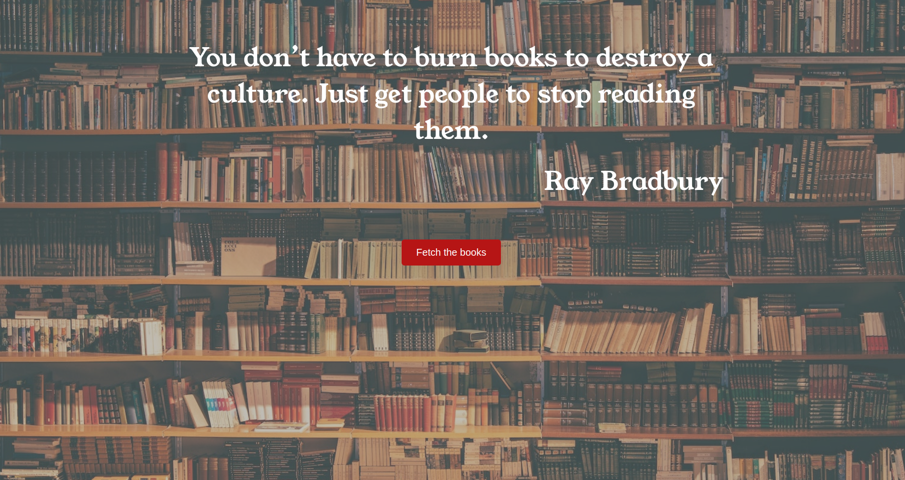
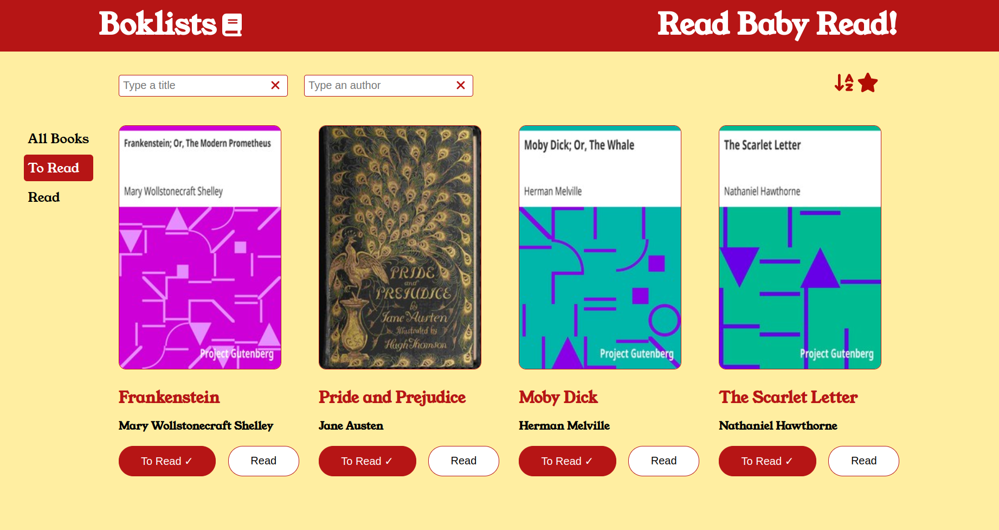
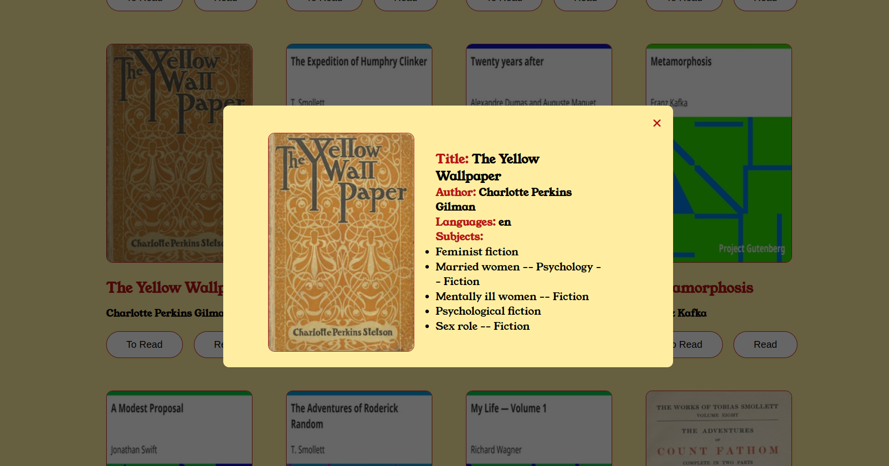

# Booklist Project

Welcome to the Booklist project! This application allows users to manage their reading list by adding books to either a "To Read" or "Read" list. Users can also rate the books they have read, search for specific titles or authors, and sort the lists alphabetically or by rating.

## Project Overview

### Introduction

The Booklist project is designed to help users organize their reading materials effectively. By allowing users to categorize books into "To Read" or "Read" lists, along with the option to add ratings, the application aims to streamline the reading experience.

### Features

- Add books to "To Read" or "Read" lists.
- Rate books in the "Read" list.
- Search for specific titles or authors.
- Sort the lists alphabetically or by rating.

### Technologies Used

The Booklist project is built using the following technologies:

- React
- react-router-dom library
- CSS
- HTML

## Screenshots

## Getting Started

To get started with the Booklist project, follow these steps:

1. Clone the repository.
2. Install the necessary dependencies.
3. Run the application using your preferred development environment.

## How to Use

1. Add books to your reading lists by specifying whether you want to read them or have already read them.
2. Provide ratings for the books you have finished.
3. Utilize the search feature to find specific books by title or author.
4. Sort the lists to organize your reading materials more effectively.